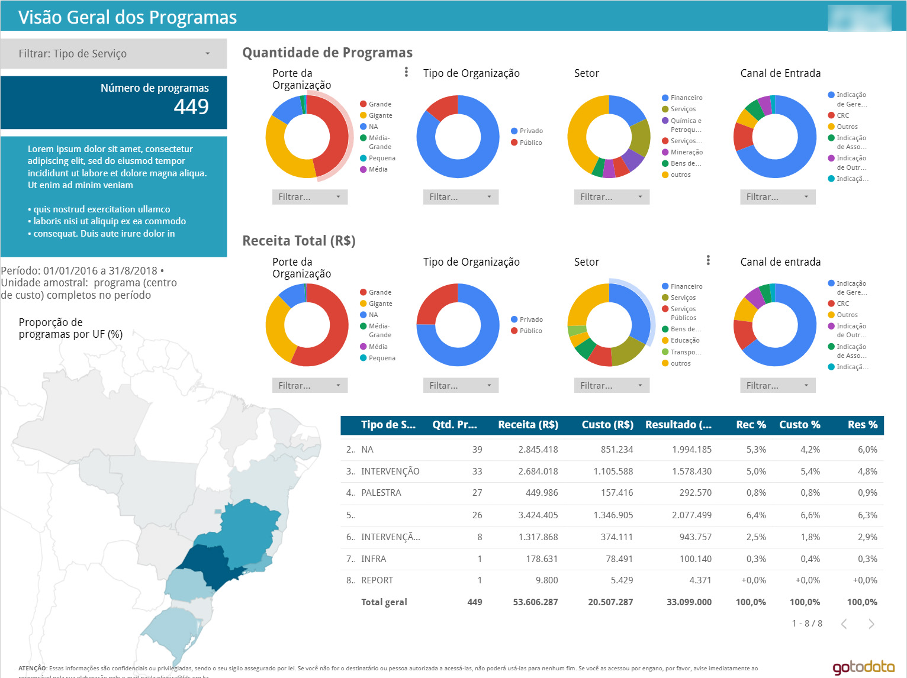
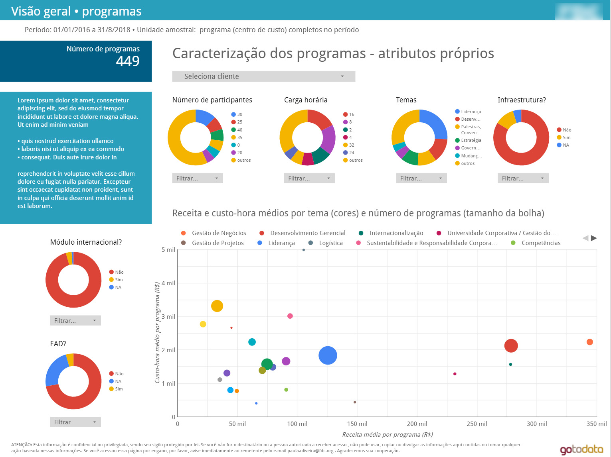
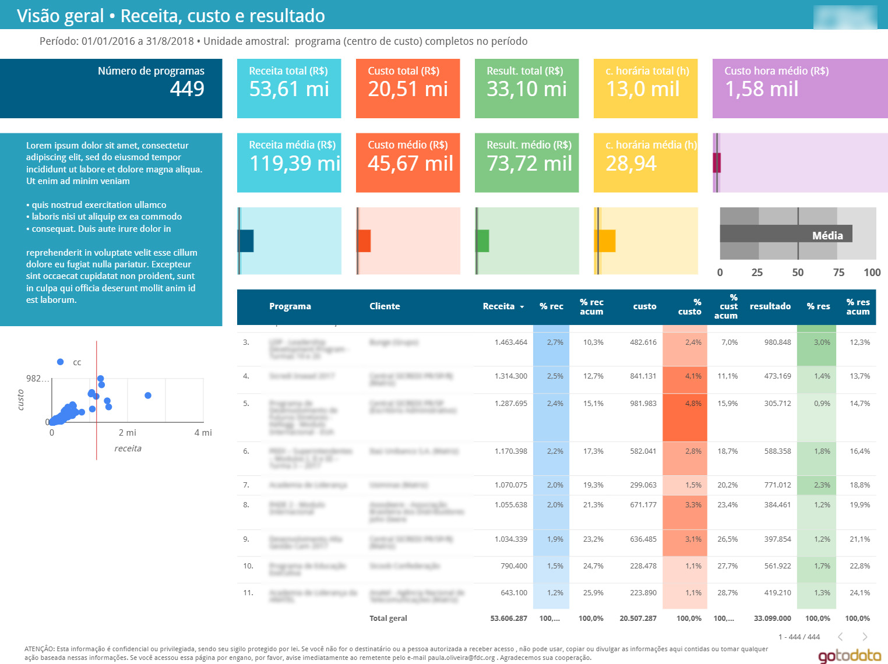

```{r setup, include=FALSE}
knitr::opts_chunk$set(echo = FALSE)

# Learn more about creating websites with Distill at:
# https://rstudio.github.io/distill/website.html

```


## A businnes report

A challenge regarding businnes dashboards is pursue an equlibrium between simplicity (easy to read) and deepness (in order to generate depth insights). The storytelling, ie, the pathway the analysis is shown plays an fundamental role here.

Some panels of a long analysis, going from general to specifics. Developed using R and Google Data Studio










## Data/ink ratio

dhuhduebhfbuehfubehbfuedbhuedhfe


## Public service

<iframe width="600" height="450" src="https://datastudio.google.com/embed/reporting/26c8c95c-175f-4ca3-888d-0bfbccf73e1b/page/5KGxB" frameborder="0" style="border:0" allowfullscreen></iframe>


<iframe width="600" height="450" src="https://app.powerbi.com/view?r=eyJrIjoiNTA3ZGY0ZjktN2ZiNy00NWNmLWE2ZjgtMGE0NDQ3NTEzYWJmIiwidCI6ImZmMmM4NDJiLTc1ZTMtNGExOS1iMTJlLWM5ZTRlYTE5MTAzNiJ9" frameborder="0" style="border:0" allowfullscreen></iframe>